# Compte rendu de l'Activité Pratique N°1 – Injection des dépendances

---

## 📁 Voici l'architecture de mon projet
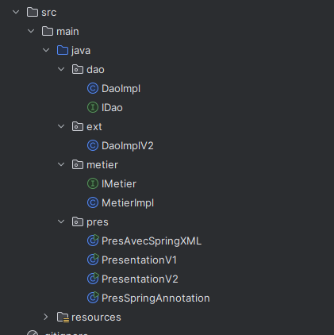

---

## 🧩 Voici l'interface `IDao` avec une méthode `getData`
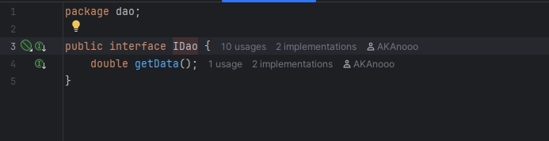+

---

## 🛠️ Voici l'implémentation de cette interface
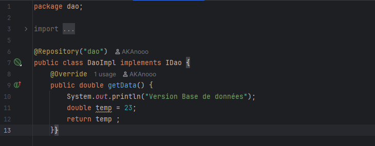

---

## 🧠 Voici l'interface `IMetier` avec une méthode `calcul`
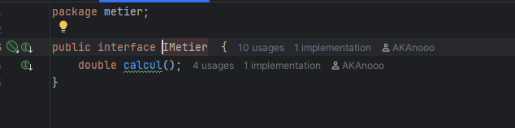

---

## 🔁 Voici une implémentation de cette interface en utilisant le couplage faible
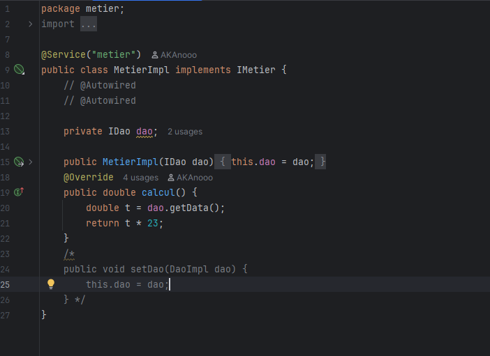

---

## 🧪 Injection des dépendances

### 1️⃣ Par instanciation statique

### 2️⃣ Par instanciation dynamique

---

## 🗂️ Fichiers de configuration & résultats

### 🔹 Fichier `config.txt` – Version base de données
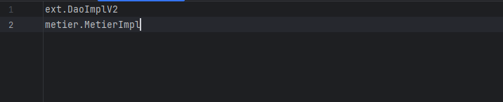

### 🔹 Sortie console – Version base de données
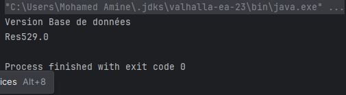

### 🔹 Fichier `config.txt` – Version web service

### 🔹 Sortie console – Version web service
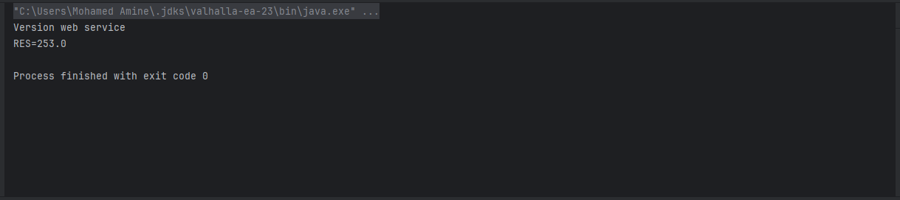

---

## 🌱 Injection des dépendances avec Spring

### a) Version XML
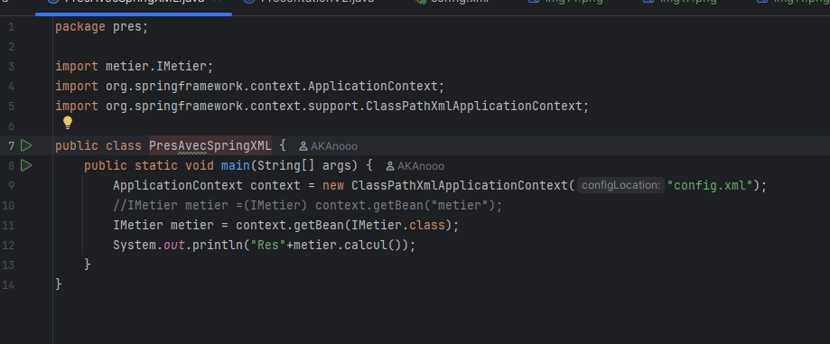

### b) Version Annotations
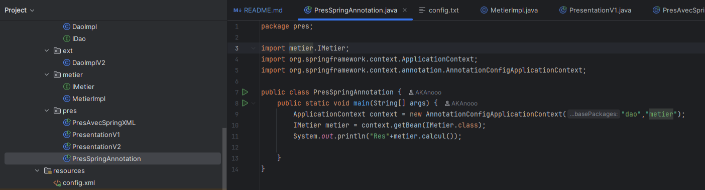

---

## 📄 Fichier `config.xml`
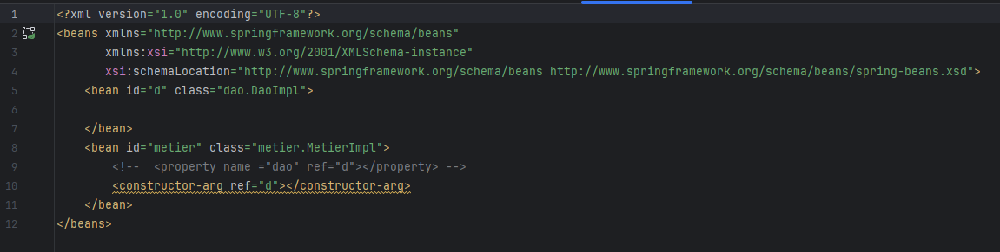

---

## 📦 Fichier `pom.xml`
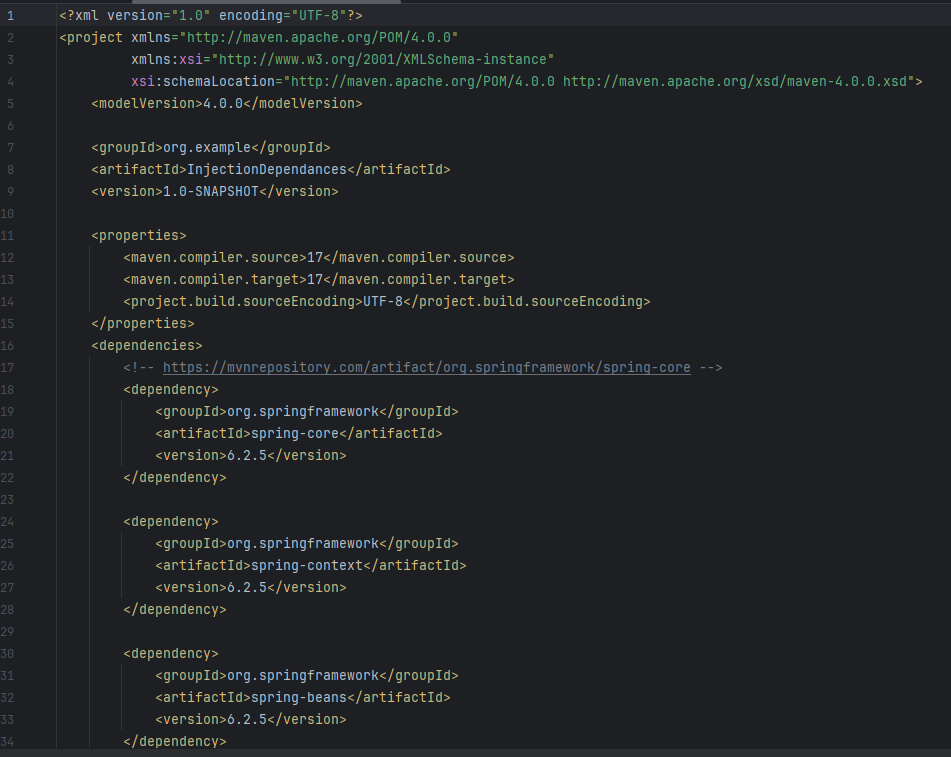

---

